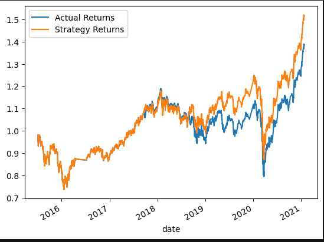
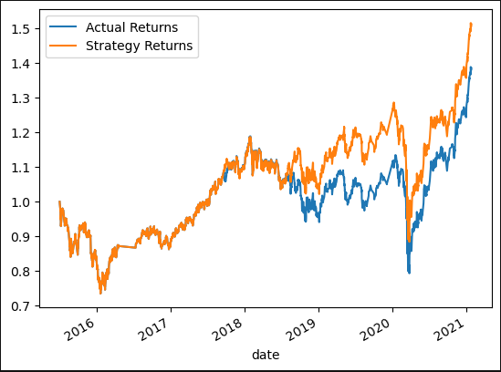
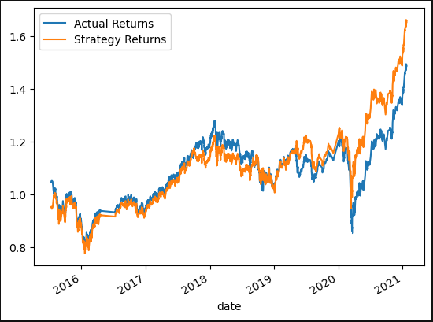
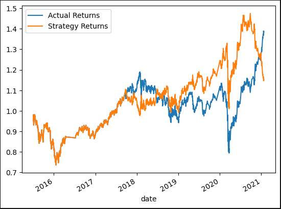

# Module_14_Challenge

## SVM model conclusions:
The baseline model shows promising results in terms of accuracy and precision, both of which exceed 60 percent. The model is non-volitile and consistent with actual returns. This leads to a large increase in the strategy's returns over time as shown in the comparative graph.

## Tuned model conclusions:
To tune the model I tested making adjustments to both the duration of the training period and the window lengths for the SMA. I wasn't able to improve the model by adjusting the training window so I kept it at a 3 month training period. To tune the SMA window lengths, I brought the short window down to 3 in to make the model more sensitive to price fluctuations. From here, I branched off to two seperate models, one that consistently exceeds actual returns and one that has exceedingly high returns at the end of the timeframe. 

## Consistant improvement
This model was achieved by setting the long window to 90. Shortening this window made the strategy slightly more sensitive to current price fluctuations. This model contained the highest score of accuracy and precision and consistantly outperforms the actual returns over time.

## Higest final returns

This model was achieved by setting the long window to 120. It's less sensitive to fluctuations than the previous model. Because of this, this tuned model model performs better over longer trends, resulting in this strategy's returns having the highest yield at the end of the timeframe. 

## Logistical Regression conclusions:
Compared to our SVM strategy the logistical regression model is much more volatile which proves to be beneficial in some instances but over time this strategy lacks security. I would suggest the logist model is a less viable stragegy based on it's volatility and weaker accuracy.

